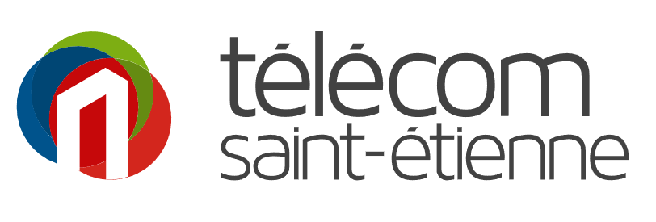
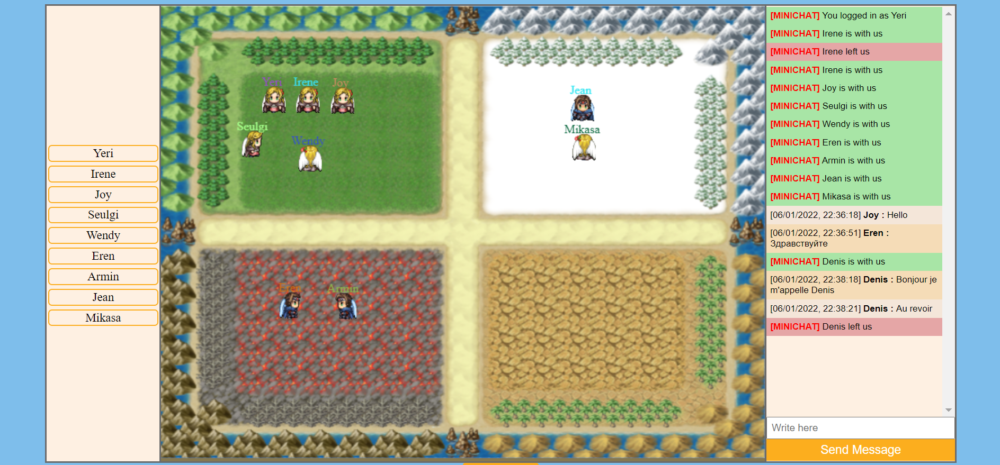
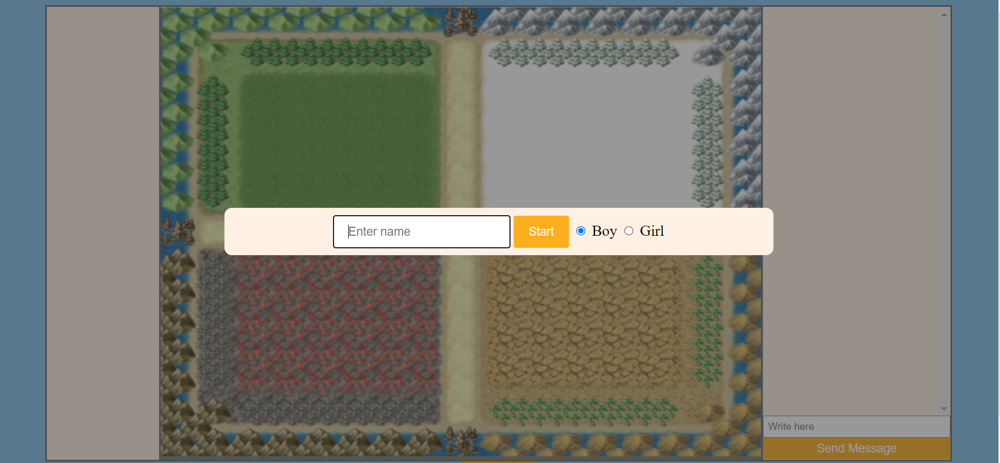
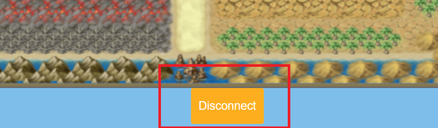

<!-- PROJECT LOGO -->
<br />
<div align="center">
  <a href="https://github.com/YeriAddict/MiniChat">
    
  </a>

  <h3 align="center">MiniChat - LEANG</h3>

</div>

<!-- TABLE OF CONTENTS -->
<details>
  <summary>Table of Contents</summary>
  <ol>
    <li>
      <a href="#about-the-project">About The Project</a>
      <ul>
        <li><a href="#built-with">Built With</a></li>
      </ul>
    </li>
    <li>
      <a href="#getting-started">Getting Started</a>
      <ul>
        <li><a href="#prerequisites">Prerequisites</a></li>
        <li><a href="#installation">Installation</a></li>
      </ul>
    </li>
    <li><a href="#usage">Usage</a></li>
    <li><a href="#contact">Contact</a></li>
  </ol>
</details>


<!-- ABOUT THE PROJECT -->
## About The Project

This is my MiniChat app for TSE where you can talk and interact with your classmates and teachers.



<p align="right">(<a href="#top">back to top</a>)</p>

### Built With

* [Node.js](https://nodejs.org/en/)
* [Express.js](https://expressjs.com/fr/)
* [Socket.io](https://socket.io/)
* [JQuery](https://jquery.com)

<p align="right">(<a href="#top">back to top</a>)</p>

<!-- GETTING STARTED -->
## Getting Started

### Prerequisites

Clone the repository with SSH or HTTPS
   ```sh
   git clone git@github.com:YeriAddict/MiniChat.git
   ```
   ```sh
   git clone https://github.com/YeriAddict/MiniChat.git
   ```

### Installation

You will need to install these dependencies 
  ```sh
  npm install --save express 
  npm install --save socket.io
  ```

<p align="right">(<a href="#top">back to top</a>)</p>

<!-- USAGE EXAMPLES -->
## Usage

1. Inside the root of the repository, type this command inside a terminal to start the app :
 ```sh
  node server.js
  ```
Typing this will also work :
 ```sh
  npm run start
  ```

2. Go to your browser and enter this URL :
 ```sh
  http://localhost:3000/
  ```

3. Enter your username and check which character you want to choose



4. You will now have an assigned character and a username. You can now enjoy chatting with your classmates or teachers on the right. You can also see who is connected on the right. In the middle, your character is also free to wander around.


5. If you wish to disconnect, you can click on the disconnect button 



<p align="right">(<a href="#top">back to top</a>)</p>

<!-- CONTACT -->
## Contact

LEANG Denis - denis.leang@telecom-st-etienne.fr 

Link: [https://github.com/YeriAddict/MiniChat](https://github.com/YeriAddict/MiniChat)

<p align="right">(<a href="#top">back to top</a>)</p>
